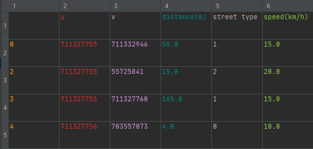

**Программа предназначена для построения кратчайшего маршрута из сети ресторанов до клиента**
---
[*Используемый датасет*](https://www.kaggle.com/jianhanma/melbourne-restaurant-food-delivery-data) включает в себя карту Мельбурна в виде графа, и вручную было сгенерировны заказы
в *.json* файле.





В консоль выводятся маршруты (как id вершин)


Краткую схему работы программы можно посмотреть по [*ссылке*](https://lucid.app/lucidchart/invitations/accept/inv_490eefa2-3ef3-4faf-92d5-82954a16f11e?viewport_loc=-3004%2C-373%2C5229%2C2511%2C0_0). Условно, стрелками обозначено зависимости или порядок выполнения программы.

В зависимости от типа создоваемого расписания, оно может быть консолидированным (строится в маршруты для одного курьера с учетом расстояний между заказов), или последовательным 
(на каждый заказ назначается новый курьер), причем во втором случае для каждого заказа можно получить 2 маршрута (кратчайший и альтернативный слегка длиннее). Для этого нужно 
указать соответствующий параметр при создании фабрики: 

```{Java} 
ScheduleFactory factory = ScheduleFactory.create(FactoryType.CONSOLIDATED);
Schedule melbourneOrders = factory.createSchedule();
```

После создания расписания и карты города, можно вызвать фунцию у расписания - `writePaths(Graph, List<Vertex>)`

*Особенности:*
* Решение задачи с помощью алгоритма Дейкстры
* Использование R-дерева для поиска ближайшей вершины графа
* Загрузка данных через DTO
* Покрытие тестами
